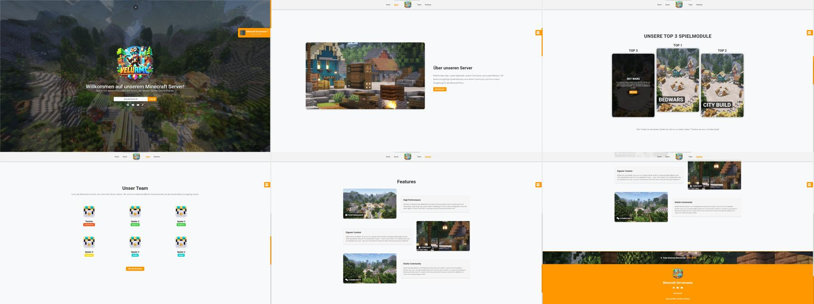

# 🛠 Minecraft Projekt Webseite

<p align="center">
  
</p>

---

<p align="center">
  
</p>

Eine moderne und flexible Webseite für Minecraft-Projekte. 🏗️ Einfach anzupassen, schnell eingerichtet und perfekt, um deinen Server oder dein Projekt professionell zu präsentieren.

---

## 📌 Demo
🔗 [Live-Demo ansehen](http://demo01.pengu-network.de)

---

## 📥 Installation

```bash
git clone https://github.com/matthewrabiega/minecraft-projekt-webseite.git
cd minecraft-projekt-webseite
```

### ⚙️ Einrichtung
- 📂 Entpacke die Dateien und lade sie auf deinen Webserver.
- 🎨 Falls nötig, passe `index.html`, `style.css` und `script.js` an.
- ✅ Nach dem Hochladen ist die Seite direkt einsatzbereit.

---

## 🎨 Anpassung

### 📝 HTML (index.html & Unterseiten)
- **Projektname & Beschreibung**: `<title>`, `<h1>`, `<p>`
- **Server-IP & Statusanzeige**: `play.deinserver.de`
- **Links zu Discord, YouTube, TikTok**
- **Teamseite, Credits und weitere Inhalte**

### 🎨 Design (style.css)
- **Hauptfarbe**: `--primary-color`
- **Hintergrundfarbe**: `--background-color`
- **Schriftart**: `font-family: 'Minecraft'`

### 🖼️ Medien
- **Logo ersetzen**: Datei `assets/img/logo.png`

### ⚙️ JavaScript (script.js)
- **Server-Status abrufen**: `loadServerStatus()`
- **Dynamische Teamseite generieren**: `displayTeamGrid()`
- **Zufällige Nachrichten anzeigen**: `typeMessage()`

---

## 📞 Support & Kontakt
Hast du Fragen oder benötigst Hilfe? ✉️ Trete unserem Discord-Server bei, klicke auf [beitreten](https://discord.gg/HcqKn7CVN5)

---

## 📜 Lizenz
© 2025 **Matthew Rabiega (TheVelu)**  
🔒 Dieses Template ist für den privaten und nicht-kommerziellen Gebrauch vorgesehen.  
🚫 Verkauf oder erneutes Hochladen ist nicht gestattet.
